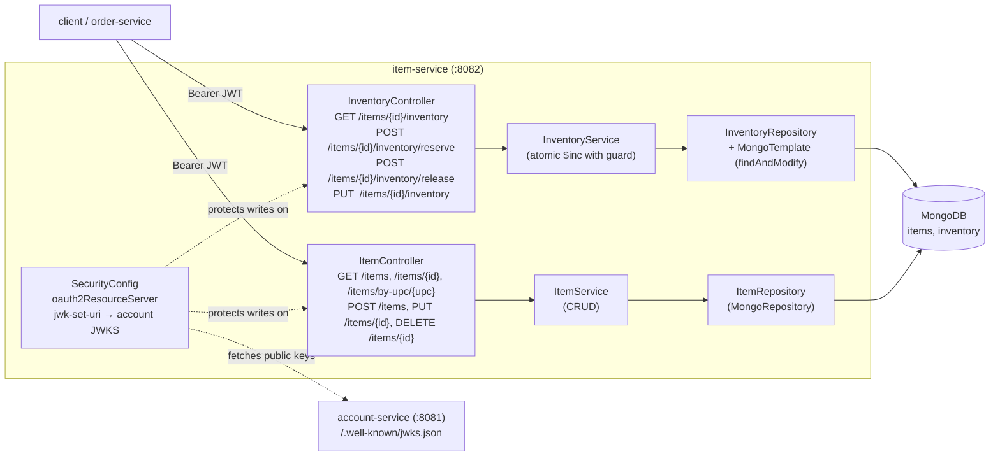

# Plan: Item Service (Phase C)

## Context

`docs/Plan Phase A.md` and `docs/Plan Phase B.md` already exist. Phase A sets
up the multi-module layout + infra compose; Phase B stands up Account +
issues JWTs and publishes a JWKS endpoint. Phase A's "phases beyond" list
names **Phase C = Item Service** as the next slice, and calls it out as the
first consumer of Account's JWKS — i.e. the first place a JWT resource-server
filter is actually needed.

`docs/requirement.md` says the Item service must expose item metadata
(unit price, name, picture URLs, UPC, item id) and is *also* responsible for
inventory lookup + update (remaining units). MongoDB is the mandated store
because item metadata is schema-flexible.

End state after this PR:
- `item-service` persists items in MongoDB (`items` collection) and tracks
  inventory atomically (`inventory` collection, one doc per item).
- Public read endpoints for browsing; authenticated write endpoints for
  catalog and inventory mutations, verified via Account's JWKS.
- `POST /items/{id}/inventory/reserve` is atomic (no oversells under
  concurrency) and returns 409 when insufficient stock.
- Service-layer Jacoco coverage ≥ 30%.
- `docker compose up` still green; `item-service` reachable on `:8082`,
  decodes JWTs minted by `account-service:8081` without any shared code.

**Prerequisite:** Phases A and B must have landed. This plan edits files the
Phase A PR creates (module skeleton, compose entry, Mongo service) and
*reads* the JWKS endpoint the Phase B PR exposes.

## Shape of the change



Key design choices (picked so reviewers can see them up front):

- **JWT verification = Spring's built-in resource server + `jwk-set-uri`.**
  No shared `common-auth` module yet — Phase A explicitly said defer until
  a second consumer. A `SecurityConfig` of ~20 lines here is cheaper than a
  premature module. When Order service (Phase D) repeats this config, the
  two files become the evidence to extract a shared module in Phase E or F.
- **Two collections, not one embedded doc.** Embedding `quantity` in the
  item doc forces the whole doc to be rewritten on every reserve/release
  and fights Mongo's per-document locking under contention. Separate
  `inventory` collection keyed by `itemId` lets us use `findAndModify` with
  a `{ $inc: { available: -n } }` update guarded by `{ available: { $gte: n } }`
  — a single atomic op that returns null when stock is insufficient (→ 409).
- **Price stored in minor units (`priceCents: long` + `currency: String`).**
  Avoids `BigDecimal`/`Decimal128` ambiguity now; UI converts on display.
  Requirement.md only mandates "unit price", not a currency model.
- **Read endpoints are public, write endpoints are authenticated.** Matches
  the shopping flow in requirement.md ("customers select an item" — no login
  needed to browse). Inventory mutations require auth because order-service
  will call them on behalf of a logged-in user.
- **No admin role yet.** Any authenticated user can create/update items.
  The spec doesn't define roles; Phase F adds `ROLE_ADMIN` if needed.

## Files to change

Paths assume the Phase A layout (`item-service/` module exists with the
HealthController skeleton and Phase A's `pom.xml`).

### 1. `item-service/pom.xml`

Add starters (versions managed by parent's Spring Boot BOM):
- `spring-boot-starter-data-mongodb`
- `spring-boot-starter-web` (already present from Phase A)
- `spring-boot-starter-security`
- `spring-boot-starter-oauth2-resource-server`
- `spring-boot-starter-validation`
- `org.springdoc:springdoc-openapi-starter-webmvc-ui`
- test: `de.flapdoodle.embed:de.flapdoodle.embed.mongo.spring3x` (embedded
  Mongo for `@DataMongoTest`), `org.springframework.security:spring-security-test`

### 2. `item-service/src/main/java/com/shopping/emarket/item/`

```
domain/
  Item.java                 @Document("items"): id (String/UUID), upc (unique
                            index), name, description, priceCents (long),
                            currency (ISO-4217), pictureUrls (List<String>),
                            category, brand, attributes (Map<String,String>),
                            createdAt, updatedAt (@CreatedDate/@LastModifiedDate)
  Inventory.java            @Document("inventory"): itemId (PK, unique index),
                            available (long, >=0), updatedAt
repo/
  ItemRepository.java       extends MongoRepository<Item,String>;
                            Optional<Item> findByUpc(String);
                            Page<Item> findByCategory(String, Pageable)
  InventoryRepository.java  extends MongoRepository<Inventory,String>;
                            plus InventoryRepositoryCustom for findAndModify
  InventoryRepositoryImpl.java  uses MongoTemplate:
                            tryReserve(itemId, qty) → Inventory | null
                              (Update.inc("available", -qty) with
                               Criteria "itemId=id AND available>=qty",
                               FindAndModifyOptions.returnNew(true))
                            release(itemId, qty) → Inventory (simple $inc)
                            setAbsolute(itemId, qty) → Inventory (upsert)
service/
  ItemService.java          create(CreateItemRequest) → seeds inventory row
                            with available=0; findById; findByUpc; list
                            (Pageable); update(id, UpdateItemRequest);
                            delete(id) → also deletes inventory row
  InventoryService.java     get(itemId); reserve(itemId, qty) throws
                            InsufficientStockException when tryReserve returns
                            null; release(itemId, qty); setAvailable(itemId, qty)
  exception/
    ItemNotFoundException, DuplicateUpcException, InsufficientStockException
web/
  ItemController.java       GET /items (paged), GET /items/{id},
                            GET /items/by-upc/{upc};
                            POST /items (201), PUT /items/{id}, DELETE /items/{id}
  InventoryController.java  GET /items/{id}/inventory;
                            POST /items/{id}/inventory/reserve {quantity};
                            POST /items/{id}/inventory/release {quantity};
                            PUT  /items/{id}/inventory {available}
  GlobalExceptionHandler.java  @ControllerAdvice:
                            ItemNotFoundException → 404,
                            DuplicateUpcException (incl. Mongo DuplicateKey) → 409,
                            InsufficientStockException → 409,
                            MethodArgumentNotValidException → 400
security/
  SecurityConfig.java       SecurityFilterChain:
                            permitAll: GET /items/**, /actuator/health,
                              /v3/api-docs/**, /swagger-ui/**,
                              GET /items/{id}/inventory;
                            anyRequest().authenticated();
                            .oauth2ResourceServer(oauth -> oauth.jwt())
                            (issuer + jwk-set-uri from application.yml)
config/
  MongoConfig.java          @EnableMongoAuditing (for @CreatedDate timestamps);
                            unique index on Item.upc and Inventory.itemId via
                            IndexOperations at startup (ApplicationRunner)
dto/
  CreateItemRequest.java, UpdateItemRequest.java, ItemResponse.java,
  InventoryResponse.java, ReserveRequest.java, SetInventoryRequest.java
  (all records; bean-validation: @NotBlank upc/name, @Positive priceCents,
   @Positive quantity on ReserveRequest)
```

### 3. `item-service/src/main/resources/application.yml`

Replace the Phase A stub:
```yaml
server.port: 8082
spring:
  application.name: item-service
  data.mongodb.uri: ${SPRING_DATA_MONGODB_URI:mongodb://localhost:27017/items}
  security.oauth2.resourceserver.jwt:
    issuer-uri: ${EMARKET_JWT_ISSUER:http://account-service:8081}
    jwk-set-uri: ${EMARKET_JWT_JWK_SET_URI:http://account-service:8081/.well-known/jwks.json}
management.endpoints.web.exposure.include: health
springdoc.swagger-ui.path: /swagger-ui.html
```

For local dev runs outside Docker, override via env to
`http://localhost:8081/.well-known/jwks.json`.

### 4. `item-service/src/test/java/com/shopping/emarket/item/`

Cover the service layer to clear the 30% Jacoco bar; controllers and
repository tests prove wiring works:
- `service/ItemServiceTest.java` — Mockito: create seeds inventory=0,
  duplicate upc throws, update persists, not-found throws, delete removes
  both documents.
- `service/InventoryServiceTest.java` — reserve happy path decrements,
  reserve with `tryReserve` returning null → `InsufficientStockException`,
  release increments, set replaces.
- `repo/InventoryRepositoryImplTest.java` — `@DataMongoTest` with
  flapdoodle: seed inventory row with available=5, `tryReserve(2)` returns
  available=3; `tryReserve(10)` returns null and document is unchanged;
  concurrent `tryReserve` via two threads never oversells
  (sum of successful reservations ≤ initial stock).
- `web/ItemControllerTest.java` — `@WebMvcTest` + `MockMvc`:
  anonymous `GET /items/{id}` → 200;
  anonymous `POST /items` → 401;
  with `@WithMockUser` (or a minted-JWT helper) `POST /items` → 201.
- `web/InventoryControllerTest.java` — `@WebMvcTest`:
  anonymous reserve → 401; authenticated reserve → 200;
  insufficient stock → 409.
- `security/SecurityConfigTest.java` (optional, thin) — asserts
  `/items` GET is open, `/items` POST is closed.

### 5. `docker/docker-compose.yml` (edit the Phase A file)

Under the existing `item-service` entry confirm/add:
- `depends_on: { mongo: { condition: service_started }, account-service: { condition: service_started } }`
- `environment:`
  ```
  SPRING_DATA_MONGODB_URI: mongodb://mongo:27017/items
  EMARKET_JWT_ISSUER: http://account-service:8081
  EMARKET_JWT_JWK_SET_URI: http://account-service:8081/.well-known/jwks.json
  ```

No new infra containers — `mongo` already came up in Phase A.

### 6. Root `README.md` (append)

"Browse & stock" quickstart (assumes Phase B's `TOKEN` step):
```
curl -sX POST localhost:8082/items -H "authorization: Bearer $TOKEN" \
  -H 'content-type: application/json' \
  -d '{"upc":"012345678905","name":"Widget","priceCents":1999,"currency":"USD","pictureUrls":[]}'
ITEM=$(curl -s localhost:8082/items | jq -r '.content[0].id')
curl -s localhost:8082/items/$ITEM
curl -sX POST localhost:8082/items/$ITEM/inventory/reserve \
  -H "authorization: Bearer $TOKEN" -H 'content-type: application/json' \
  -d '{"quantity":1}'
curl -s localhost:8082/items/$ITEM/inventory
```

## Execution order

1. Add starters to `item-service/pom.xml`; `./mvnw -pl item-service
   dependency:tree` confirms `spring-security-oauth2-resource-server` and
   `spring-data-mongodb` on the path.
2. Write `Item`, `Inventory` documents + `ItemRepository`,
   `InventoryRepository(+Custom+Impl)` + `MongoConfig` unique-index setup.
3. Write `InventoryRepositoryImplTest` first (hardest correctness property:
   the atomic-reserve contract). Green before moving on.
4. Write `ItemService`, `InventoryService` + their `*ServiceTest`s.
5. Write `SecurityConfig`, the two controllers, `GlobalExceptionHandler`,
   DTOs, and `@WebMvcTest`s.
6. `./mvnw -pl item-service clean verify` — green, Jacoco ≥ 30% on `service/`.
7. Update compose env; `docker compose up --build -d mongo account-service
   item-service`; walk through the README quickstart end-to-end against the
   live stack (create → list → reserve → inventory).
8. Open the PR; move this plan file to `docs/Plan Phase C.md` as part of the
   commit so the docs chain stays in the repo (matching Phase A/B).

## Verification

- `./mvnw -pl item-service clean verify` passes; Jacoco HTML at
  `item-service/target/site/jacoco/index.html` shows `service/` ≥ 30%.
- `docker compose up --build -d` then, from the host:
  - `curl -fsS localhost:8082/actuator/health` → `{"status":"UP"}`.
  - Register + login against `:8081` (Phase B flow), export `TOKEN`.
  - README quickstart commands all succeed: create item (201), list item
    (200), reserve 1 (200, available decremented), read inventory (200).
  - A second reserve for more units than remain returns 409 and the
    inventory document is not mutated (`docker compose exec mongo mongosh
    items --eval 'db.inventory.find().pretty()'`).
- Negative checks:
  - `POST /items` without a bearer → 401.
  - `POST /items` with a JWT whose signature was tampered → 401.
  - Duplicate UPC → 409 (`DuplicateUpcException` from the unique index).
  - `GET /items/does-not-exist` → 404.
- Cross-service sanity: stop `account-service`, restart `item-service` with
  an existing JWT in cache — existing GETs still work (public), but a write
  call fails fast because `jwk-set-uri` is unreachable. Restart
  `account-service`, retry → 200. (Confirms we're really fetching JWKS.)

## Out of scope (explicitly deferred)

- Shared `common-auth` module — wait until Order service (Phase D) duplicates
  the SecurityConfig so we have a second call site to factor against.
- Catalog search (text search, filters beyond category) — requirement.md
  doesn't call for it.
- Image upload / file storage for `pictureUrls` — callers supply URLs.
- Admin role / RBAC — single implicit `ROLE_USER` for now.
- Inventory event publishing to Kafka — Order service owns cross-service
  events in Phase D; inventory stays REST-only here.
- Caching layer (Redis) for hot item reads — Phase F hardening, if at all.
- Soft-delete / audit log on items — not in spec.