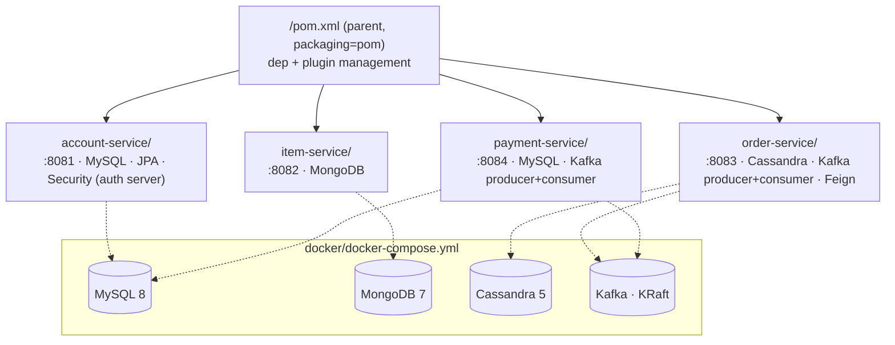

# Plan: Emarket microservices — foundational restructure (Phase A)

## Context

The repo is a fresh Spring Boot 4.0.5 scaffold that does not even compile
(`EmarketApplication.java:9` has `public tatic void main` — missing `s`). The
spec in `docs/requirement.md` requires a four-service system (Account, Item,
Order, Payment) across MySQL, MongoDB, Cassandra, and Kafka, with JWT auth,
Swagger, Jacoco ≥30%, and one-click Docker bring-up. None of that exists yet.

Implementing the whole spec in one PR is not realistic. This plan delivers
**Phase A only**: convert the single-module scaffold into a multi-module Maven
layout with a runnable skeleton for each service and a working
`docker-compose` for the infrastructure. Each service PR after this one drops
into a ready slot instead of reshuffling the build.

End state after this PR:
- `./mvnw verify` compiles and tests all four service modules.
- `docker compose up` brings up MySQL, MongoDB, Cassandra, Kafka, and the four
  service containers; each service exposes `/actuator/health` returning 200.
- Dependency management is centralized in the parent POM so later phases only
  add starters, never versions.

## Shape of the change



Phases beyond this PR (each a separate PR, listed here only so the direction
is legible — **not implemented in this session**):

1. **Phase B — Account + auth server.** JPA entities, `/auth/token` issuing
   JWT signed with an RSA key, JWKS endpoint, Spring Security config.
2. **Phase C — Item service.** Mongo document, metadata + inventory endpoints,
   JWT resource-server filter consuming Account's JWKS.
3. **Phase D — Order service.** Cassandra schema, state machine, Kafka
   producer (`order.events`), consumer (`payment.events`), Feign client to Item.
4. **Phase E — Payment service.** Idempotency table in MySQL, Kafka consumer
   (`order.events`), producer (`payment.events`), Submit/Update/Reverse/Lookup.
5. **Phase F — Hardening.** Jacoco ≥30% per module, Swagger polish, README
   demo flow, optional sample UI.

## Files to change in this PR

### 1. Fix the typo (so history has one compiling commit before the restructure)
- `src/main/java/com/shopping/emarket/EmarketApplication.java:9` — `tatic` → `static`.

(Then the next commit deletes this file as part of the restructure; fixing
first keeps `git log -p` readable.)

### 2. Convert root to parent POM
- `pom.xml` — change `<packaging>` to `pom`, drop the `<dependencies>` block,
  add `<modules>` listing `account-service`, `item-service`, `order-service`,
  `payment-service`. Move Spring Boot version, Java 21, and Jacoco plugin
  config into `<dependencyManagement>` / `<pluginManagement>` so children just
  reference artifacts without versions. Keep `spring-boot-starter-parent` as
  the `<parent>`.

### 3. Delete the old single-module sources
- Remove `src/main/java/com/shopping/emarket/EmarketApplication.java`,
  `src/test/java/com/shopping/emarket/EmarketApplicationTests.java`,
  `src/main/resources/application.properties`. The four new modules replace them.

### 4. Create four service modules
Each module uses package `com.shopping.emarket.<service>` per the CLAUDE.md
convention and has the same skeleton:

```
<service>/
  pom.xml                                     (inherits parent, only adds starters it needs)
  Dockerfile                                  (eclipse-temurin:21-jre-alpine, COPY target/*.jar)
  src/main/java/com/shopping/emarket/<svc>/
    <Svc>Application.java                     (@SpringBootApplication)
    web/HealthController.java                 (GET /health → {"service":"<svc>","status":"UP"})
  src/main/resources/application.yml          (server.port, spring.application.name, management.endpoints.web.exposure.include=health)
  src/test/java/com/shopping/emarket/<svc>/
    <Svc>ApplicationTests.java                (contextLoads)
    web/HealthControllerTest.java             (@WebMvcTest, asserts 200 + body)
```

Starters per module (only these, nothing speculative):
- **account-service** (`:8081`) — `spring-boot-starter-web`,
  `spring-boot-starter-actuator`, `spring-boot-starter-test`.
- **item-service** (`:8082`) — same three.
- **order-service** (`:8083`) — same three.
- **payment-service** (`:8084`) — same three.

DB/Kafka/Security starters are **declared in the parent's
`<dependencyManagement>`** (versions only, via the Spring Boot BOM already
inherited) but **not pulled into any module** until its Phase B–E PR adds it.
This keeps Phase A's build fast and green.

### 5. Docker / compose
- `docker/docker-compose.yml`:
  - `mysql:8` with root password, init volume mounting `docker/mysql/init.sql`
    which creates `account` and `payment` schemas.
  - `mongo:7` exposing 27017.
  - `cassandra:5` with `CASSANDRA_CLUSTER_NAME=emarket`, healthcheck on `cqlsh`.
  - `kafka:<confluent>` in KRaft mode (no Zookeeper) on 9092.
  - Four service entries: `build: ../<service>`, `depends_on` their datastore
    with `condition: service_healthy`, env vars for host names (e.g.
    `SPRING_DATASOURCE_URL=jdbc:mysql://mysql:3306/account`).
- `docker/mysql/init.sql` — `CREATE DATABASE IF NOT EXISTS account; CREATE DATABASE IF NOT EXISTS payment;`
- Per-service `Dockerfile` is identical shape, parameterized only by the jar name.

### 6. Root `README.md`
Short: prerequisites (Docker, JDK 21 only if running outside Docker), the two
commands (`./mvnw verify`, `docker compose -f docker/docker-compose.yml up
--build`), the port map, and a "next phases" pointer to `docs/requirement.md`.

## Execution order

1. Fix the typo on `EmarketApplication.java:9`, commit.
2. Write the new parent `pom.xml` and the four `<service>/pom.xml` files.
3. Create the four `<Svc>Application.java` + `HealthController.java` +
   `application.yml` + tests.
4. Delete the old `com.shopping.emarket` app, test, and `application.properties`.
5. Run `./mvnw clean verify` — must be green before touching Docker.
6. Add `docker/docker-compose.yml`, `docker/mysql/init.sql`, and the four
   Dockerfiles.
7. Build the images (`docker compose build`) and bring the stack up; confirm
   each `/health` returns 200 from the host.
8. Write `README.md`.
9. Open the PR.

## Verification

- `./mvnw clean verify` — four modules build, tests pass, Jacoco report is
  generated per module (coverage will be low; the 30% gate is enabled but not
  enforced until Phase F so this PR doesn't fail its own check).
- `docker compose -f docker/docker-compose.yml up --build -d`, then
  `curl -fsS localhost:8081/health`, `...:8082/health`, `...:8083/health`,
  `...:8084/health` — all return `{"service":"...","status":"UP"}`.
- `docker compose ps` — `mysql`, `mongo`, `cassandra`, `kafka` all
  `healthy`; the four service containers are `running`.
- `docker compose down -v` cleans up without errors.

## Out of scope (explicitly deferred)

- Any business logic, entities, repositories, or Kafka topics.
- Spring Security config and JWT issuance (Phase B).
- Swagger/springdoc wiring (added per-service in Phases B–E).
- Jacoco threshold enforcement (Phase F, once services have real tests).
- A shared `common` module — defer until the first cross-service concern
  (JWT resource-server filter in Phase C) actually needs it.
