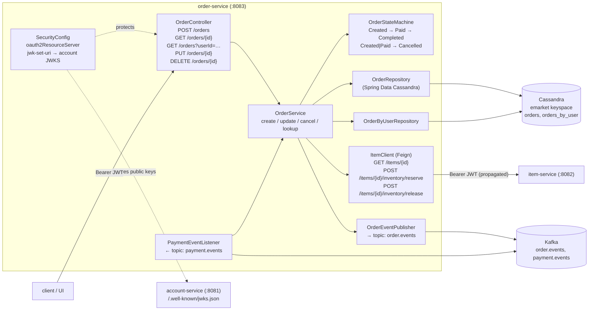

# Plan: Order Service (Phase D)

## Context

`docs/Plan Phase A.md`, `Plan Phase B.md`, and `Plan Phace C.md` already exist.
Phase A sets up the multi-module layout + infra compose (including the
`cassandra` and `kafka` containers). Phase B stands up Account + issues JWTs
and exposes JWKS. Phase C stands up Item + inventory with an atomic reserve
endpoint, and is the first consumer of the Account JWKS.

Phase A's "phases beyond" list names **Phase D = Order Service** as the next
slice. `docs/requirement.md` pins the scope:

- Four order operations — *Create*, *Cancel*, *Update*, *Lookup*.
- Each order carries state: `Created → Paid → Completed → Cancelled`.
- Cassandra is the mandated store; schema must be reasonable for Cassandra
  (i.e. designed around the query, not copied from relational).
- Order service must **both produce and consume** Kafka. In this system the
  natural split is: produces `order.events` (downstream: Payment triggers on
  `OrderCreated`, notification/email consumers trigger on `OrderCompleted`);
  consumes `payment.events` (to flip `Created → Paid` on success, or
  `Cancelled` on failure).
- Sync inter-service call to Item service for price/stock — OpenFeign is the
  explicit recommendation in the spec, so we use Feign here (Phase C used
  none, so this is also where Feign enters the codebase).

End state after this PR:
- `order-service` persists orders in Cassandra (`orders` table, plus a
  `orders_by_user` query table) via Spring Data Cassandra.
- `POST /orders` reserves stock via Feign → Item, persists an `Order` in
  `Created`, and publishes `OrderCreated` to `order.events`.
- `PUT /orders/{id}` (update items, only legal in `Created`), `DELETE
  /orders/{id}` (cancel — legal in `Created` or `Paid`, releases stock and
  emits `OrderCancelled`), `GET /orders/{id}`, `GET /orders?userId=…`.
- Kafka consumer on `payment.events` flips order state: `PaymentSucceeded`
  → `Paid` → emits `OrderCompleted` once fulfilment is recorded (for this
  phase "fulfilment" is immediate: `Paid → Completed` on the same message;
  Phase F can split it if needed); `PaymentFailed` → `Cancelled` + release
  stock.
- State transitions are centralised in one `OrderStateMachine` so illegal
  moves (e.g. `Completed → Created`) throw a 409.
- Service-layer Jacoco coverage ≥ 30%.
- `docker compose up` still green; `order-service` reachable on `:8083`,
  decodes JWTs from Account's JWKS, talks to Item via Feign, talks to Kafka.

**Prerequisite:** Phases A, B, and C must have landed.

## Shape of the change



Key design choices (picked so reviewers can see them up front):

- **Two Cassandra tables, not one.** `orders` keyed by `(orderId)` for
  point lookup; `orders_by_user` keyed by `((userId), createdAt DESC, orderId)`
  for listing a user's orders. This is the standard "query-first" Cassandra
  pattern — one logical order is written to both tables by `OrderService`.
  Avoids secondary indexes on a partition key choice we'd regret later.
- **State machine in a dedicated class, not scattered in the service.**
  Legal transitions are a small table; codifying them prevents "it worked in
  the unit test because that path happened to be called" bugs. The machine
  owns the invariants; the service owns the IO.
- **Feign call to Item is synchronous and on the write path.** `POST /orders`
  first reserves stock via Item; only on success do we persist + emit
  `OrderCreated`. If reservation fails (409), we fail the whole create — no
  partial order in `Created` with no stock held. If persist fails *after*
  reservation succeeds, we call `release` in a `catch` to compensate. This
  is simpler than a saga, which isn't justified at Phase D scope.
- **JWT is propagated to Feign.** A `RequestInterceptor` copies the incoming
  `Authorization` header onto outbound Item calls so Item's write endpoints
  (reserve/release) accept them. No service-to-service client credentials in
  Phase D; Phase F can harden this.
- **Kafka payloads are JSON with an explicit `type` field**, not
  polymorphic-class serialisation. Keeps Payment (Phase E) free to use any
  JSON library without a shared event jar. Schema is documented in
  `docs/events.md` (new, short).
- **Consumer idempotency by `paymentId` + current state check.** Replayed
  `PaymentSucceeded` for an already-`Paid`/`Completed` order is a no-op
  (logged, not an error). Replayed `PaymentFailed` against a `Cancelled`
  order is also a no-op. This matters: Kafka is at-least-once.
- **No shared `common-auth` module yet.** Phase C deferred it until a second
  consumer of JWKS exists; Phase D *is* that second consumer, so the
  `SecurityConfig` here will be near-identical to Item's. **Extracting the
  shared module is in Phase E or F's plan**, not this one — we want both
  call sites committed first so the abstraction is grounded.

## Files to change

Paths assume the Phase A layout (`order-service/` module exists with the
HealthController skeleton and Phase A's `pom.xml`).

### 1. `order-service/pom.xml`

Add starters (versions managed by parent's Spring Boot BOM):
- `spring-boot-starter-data-cassandra`
- `spring-boot-starter-web` (already present from Phase A)
- `spring-boot-starter-security`
- `spring-boot-starter-oauth2-resource-server`
- `spring-boot-starter-validation`
- `spring-kafka` (Spring Boot manages the version)
- `org.springframework.cloud:spring-cloud-starter-openfeign` — introduce
  `spring-cloud-dependencies` BOM import in the parent `dependencyManagement`
  (Phase A left a slot for this; if not, this PR adds it).
- `org.springdoc:springdoc-openapi-starter-webmvc-ui`
- test:
  - `org.testcontainers:cassandra`, `org.testcontainers:kafka`,
    `org.testcontainers:junit-jupiter` — for real-infra integration tests
    (unit tests stay in-memory via mocks).
  - `org.springframework.kafka:spring-kafka-test` — `EmbeddedKafka` + test
    helpers for the consumer test.
  - `org.springframework.security:spring-security-test`.
  - `com.github.tomakehurst:wiremock-jre8` — for Feign contract test
    against a stubbed Item.

### 2. `order-service/src/main/java/com/shopping/emarket/order/`

```
domain/
  Order.java                  @Table("orders"): id (UUID PK), userId (UUID),
                              status (enum), items (List<OrderLine> frozen UDT),
                              subtotalCents (long), currency, createdAt,
                              updatedAt, paymentId (UUID, nullable)
  OrderByUser.java            @Table("orders_by_user"): partition userId,
                              clustering (createdAt DESC, orderId); same
                              denormalised columns needed for listing
  OrderLine.java              @UserDefinedType("order_line"): itemId (UUID),
                              upc, name, unitPriceCents (long), quantity (int)
  OrderStatus.java            enum: CREATED, PAID, COMPLETED, CANCELLED
state/
  OrderStateMachine.java      transition(OrderStatus from, OrderEvent event)
                              → OrderStatus; throws IllegalStateTransition.
                              Events: PAYMENT_SUCCEEDED, PAYMENT_FAILED,
                              USER_CANCELLED, FULFILLED.
repo/
  OrderRepository.java        extends CassandraRepository<Order, UUID>
  OrderByUserRepository.java  extends CassandraRepository<OrderByUser, MapId>;
                              Slice<OrderByUser> findByUserId(UUID, Pageable)
service/
  OrderService.java           create(CreateOrderRequest, userId) →
                              1. For each line: Feign GET /items/{id} to
                                 snapshot name/price/upc (price-at-order).
                              2. For each line: Feign POST reserve; on 409,
                                 release already-reserved lines and throw
                                 InsufficientStockException.
                              3. Build Order(status=CREATED), persist to
                                 both tables (batched logged write if both
                                 are in the same keyspace).
                              4. Publish OrderCreated; return response.
                              update(id, userId, UpdateOrderRequest) —
                                 only legal in CREATED; diff lines, release
                                 removed, reserve added, rewrite Order.
                              cancel(id, userId) —
                                 state-machine USER_CANCELLED, release all
                                 reserved stock, persist, emit OrderCancelled.
                              findById(id), findByUser(userId, Pageable).
                              applyPaymentResult(PaymentEvent) —
                                 called by the consumer; uses the state
                                 machine; idempotent on repeat.
  exception/
    OrderNotFoundException, IllegalOrderTransitionException,
    InsufficientStockException, ItemLookupFailedException.
kafka/
  KafkaTopics.java            constants: ORDER_EVENTS="order.events",
                              PAYMENT_EVENTS="payment.events"
  events/
    OrderEvent.java           sealed interface; records: OrderCreated,
                              OrderCancelled, OrderCompleted.
                              All carry orderId, userId, occurredAt, plus
                              event-specific fields.
    PaymentEvent.java         sealed interface; records: PaymentSucceeded
                              (paymentId, orderId, amountCents),
                              PaymentFailed (paymentId, orderId, reason).
  OrderEventPublisher.java    KafkaTemplate<String, String>; key = orderId,
                              value = Jackson-serialised JSON with an
                              explicit "type" discriminator.
  PaymentEventListener.java   @KafkaListener(topics="payment.events",
                              groupId="order-service"); parses by "type",
                              delegates to OrderService.applyPaymentResult.
client/
  ItemClient.java             @FeignClient(name="item-service",
                                url="${emarket.item.base-url}")
                              GET /items/{id} → ItemSnapshot;
                              POST /items/{id}/inventory/reserve;
                              POST /items/{id}/inventory/release.
  FeignAuthInterceptor.java   RequestInterceptor: copies the current
                              request's Authorization header to outbound
                              Feign calls (SecurityContext → Jwt → raw token
                              via JwtAuthenticationToken.getToken().getTokenValue()).
web/
  OrderController.java        All endpoints require auth. userId taken from
                              JWT sub (UUID-parsed) — not from the request
                              body, so a user can only order for themselves.
                              Mapped: POST /orders (201), GET /orders/{id},
                              GET /orders (paged, for the current user),
                              PUT /orders/{id}, DELETE /orders/{id}.
  GlobalExceptionHandler.java @ControllerAdvice:
                              OrderNotFoundException → 404,
                              IllegalOrderTransitionException → 409,
                              InsufficientStockException → 409,
                              ItemLookupFailedException → 502,
                              MethodArgumentNotValidException → 400.
security/
  SecurityConfig.java         SecurityFilterChain:
                              permitAll: /actuator/health, /v3/api-docs/**,
                                /swagger-ui/**;
                              anyRequest().authenticated();
                              .oauth2ResourceServer(oauth -> oauth.jwt());
                              issuer + jwk-set-uri from application.yml.
config/
  CassandraConfig.java        @EnableCassandraRepositories;
                              SchemaAction.CREATE_IF_NOT_EXISTS in dev so
                              keyspace/tables exist on first run; prod
                              override = NONE.
  FeignConfig.java            registers FeignAuthInterceptor.
  KafkaConfig.java            producer + consumer JSON configs; error
                              handler on the listener container that logs
                              and sends poison messages to a dead-letter
                              topic `payment.events.dlt` (auto-created).
dto/
  CreateOrderRequest.java     userId is NOT in this DTO (JWT owns it);
                              lines: [{itemId, quantity}]. @NotEmpty lines,
                              @Positive quantity.
  UpdateOrderRequest.java     replacement lines list (full replace, not
                              patch — simpler semantics).
  OrderResponse.java          exposes the full Order including status and
                              OrderLine[] with priced snapshots.
  ItemSnapshot.java           Feign response DTO (subset of item-service's
                              ItemResponse).
```

### 3. `order-service/src/main/resources/`

- `application.yml` — replace the Phase A stub:
  ```yaml
  server.port: 8083
  spring:
    application.name: order-service
    cassandra:
      contact-points: ${SPRING_CASSANDRA_CONTACT_POINTS:localhost}
      port: 9042
      keyspace-name: ${SPRING_CASSANDRA_KEYSPACE:emarket}
      local-datacenter: ${SPRING_CASSANDRA_LOCAL_DC:datacenter1}
      schema-action: CREATE_IF_NOT_EXISTS
    kafka:
      bootstrap-servers: ${SPRING_KAFKA_BOOTSTRAP_SERVERS:localhost:9092}
      consumer:
        group-id: order-service
        auto-offset-reset: earliest
        key-deserializer: org.apache.kafka.common.serialization.StringDeserializer
        value-deserializer: org.apache.kafka.common.serialization.StringDeserializer
      producer:
        key-serializer: org.apache.kafka.common.serialization.StringSerializer
        value-serializer: org.apache.kafka.common.serialization.StringSerializer
    security.oauth2.resourceserver.jwt:
      issuer-uri: ${EMARKET_JWT_ISSUER:http://account-service:8081}
      jwk-set-uri: ${EMARKET_JWT_JWK_SET_URI:http://account-service:8081/.well-known/jwks.json}
  emarket:
    item.base-url: ${EMARKET_ITEM_BASE_URL:http://item-service:8082}
  management.endpoints.web.exposure.include: health
  springdoc.swagger-ui.path: /swagger-ui.html
  ```
- `cql/keyspace.cql` — `CREATE KEYSPACE IF NOT EXISTS emarket WITH
  replication = {'class':'SimpleStrategy','replication_factor':1};` plus a
  UDT definition for `order_line`. Loaded once at startup by a
  `CassandraInitializer` `ApplicationRunner` via the driver's raw session
  (keyspace must exist *before* Spring's `schema-action` runs).

### 4. `order-service/src/test/java/com/shopping/emarket/order/`

Cover the service layer to clear the 30% Jacoco bar; the tricky correctness
properties (state machine, consumer idempotency, Cassandra query-table
writes) get dedicated tests.

- `state/OrderStateMachineTest.java` — table-driven: every legal transition
  returns the expected target; every illegal transition throws. Cheap,
  catches regressions to the invariant set.
- `service/OrderServiceTest.java` (Mockito) —
  - `create` happy path: Feign returns items, reserve returns 200, both
    repositories get a `save`, publisher gets `OrderCreated`.
  - `create` with insufficient stock on line 2: line 1's reservation is
    released, no order persisted, no event emitted.
  - `create` where Feign throws on reserve: compensating release called
    for already-reserved lines.
  - `cancel` from `CREATED`: releases stock, persists `CANCELLED`, emits
    `OrderCancelled`.
  - `cancel` from `COMPLETED`: throws `IllegalOrderTransitionException`
    (via state machine).
  - `applyPaymentResult(PaymentSucceeded)` for `CREATED`: advances to
    `PAID`, then to `COMPLETED` (same-message fulfilment), emits
    `OrderCompleted`. For already-`PAID`/`COMPLETED`: no-op, no event.
  - `applyPaymentResult(PaymentFailed)` for `CREATED`: releases stock,
    transitions to `CANCELLED`, emits `OrderCancelled`. For `CANCELLED`:
    no-op.
- `kafka/OrderEventPublisherTest.java` — given an `OrderCreated` record,
  the message sent has key = orderId, value parses back to the same record
  with `type=OrderCreated`.
- `kafka/PaymentEventListenerTest.java` — `@SpringBootTest(properties=…)`
  + `EmbeddedKafka`: publish a `PaymentSucceeded` JSON, assert
  `OrderService.applyPaymentResult` was invoked with the correct record
  within 5 s. Uses a `@MockBean` `OrderService` so the test doesn't touch
  Cassandra.
- `client/ItemClientTest.java` — WireMock + Feign auto-config:
  - 200 → parsed into `ItemSnapshot` correctly.
  - 409 on reserve → `FeignException.Conflict` surfaces (service translates
    this to `InsufficientStockException`; assertion lives in
    `OrderServiceTest`).
  - Request has `Authorization: Bearer <token>` set by the interceptor
    (assert against the recorded WireMock request).
- `repo/OrderRepositoryIT.java` — `@Testcontainers` with `cassandra:5`:
  insert into both tables, read back via both access paths, confirm the
  second table is ordered by `createdAt DESC`. Tagged as `integration` so
  it can be skipped in fast local loops (`-DexcludedGroups=integration`);
  CI runs it unfiltered.
- `web/OrderControllerTest.java` — `@WebMvcTest`:
  anonymous `POST /orders` → 401; authenticated → 201; illegal cancel
  (already `COMPLETED`) → 409; Bean-Validation failure → 400.

### 5. `docker/docker-compose.yml` (edit the Phase A file)

Under the existing `order-service` entry add:
- `depends_on:`
  ```
  cassandra:      { condition: service_healthy }
  kafka:          { condition: service_started }
  account-service:{ condition: service_started }
  item-service:   { condition: service_started }
  ```
- `environment:`
  ```
  SPRING_CASSANDRA_CONTACT_POINTS: cassandra
  SPRING_CASSANDRA_KEYSPACE: emarket
  SPRING_CASSANDRA_LOCAL_DC: datacenter1
  SPRING_KAFKA_BOOTSTRAP_SERVERS: kafka:9092
  EMARKET_JWT_ISSUER: http://account-service:8081
  EMARKET_JWT_JWK_SET_URI: http://account-service:8081/.well-known/jwks.json
  EMARKET_ITEM_BASE_URL: http://item-service:8082
  ```

No new infra containers — `cassandra` and `kafka` came up in Phase A.

### 6. `docs/events.md` (new)

Short reference of the two topics this PR introduces, so Phase E has a
contract to code against:
- Topic `order.events`, key = orderId, JSON values, schemas for
  `OrderCreated`, `OrderCancelled`, `OrderCompleted` (fields + types).
- Topic `payment.events`, key = orderId, JSON values, schemas for
  `PaymentSucceeded`, `PaymentFailed`. Phase D publishes *nothing* to this
  topic; it only consumes. Phase E owns the publisher side.
- Idempotency note: consumers MUST tolerate replays; keys chosen to make
  co-partitioning by orderId trivial.

### 7. Root `README.md` (append)

"Place an order" quickstart (assumes Phase B's `TOKEN` + Phase C's seeded
item):
```
curl -sX POST localhost:8083/orders -H "authorization: Bearer $TOKEN" \
  -H 'content-type: application/json' \
  -d "{\"lines\":[{\"itemId\":\"$ITEM\",\"quantity\":1}]}"

ORDER=$(curl -s -H "authorization: Bearer $TOKEN" \
  "localhost:8083/orders" | jq -r '.content[0].id')
curl -s -H "authorization: Bearer $TOKEN" "localhost:8083/orders/$ORDER"

# cancel while Created
curl -sX DELETE -H "authorization: Bearer $TOKEN" "localhost:8083/orders/$ORDER"
```

Also add a Kafka-inspection snippet:
```
docker compose exec kafka kafka-console-consumer.sh \
  --bootstrap-server localhost:9092 --topic order.events --from-beginning --max-messages 1
```

## Execution order

1. Add starters + Spring Cloud BOM to `order-service/pom.xml` (and the
   parent `dependencyManagement` if Phase A didn't land it); `./mvnw -pl
   order-service dependency:tree` confirms `spring-cloud-starter-openfeign`,
   `spring-kafka`, `spring-data-cassandra` are all on the path.
2. Write `OrderStateMachine` + its table-driven test **first**. The rest of
   the service is built around its contract, so get it right before anything
   depends on it.
3. Write Cassandra schema init (`keyspace.cql` + `CassandraInitializer`) +
   entities + repositories + `OrderRepositoryIT` (Testcontainers). Green
   before building service on top.
4. Write `ItemClient` + `FeignAuthInterceptor` + WireMock test.
5. Write `OrderEventPublisher` + its test; write `OrderService.create/
   cancel/update/lookup` + unit tests (reservation compensation is the
   hardest path — cover it explicitly).
6. Write `PaymentEventListener` + `EmbeddedKafka` test; wire it to
   `OrderService.applyPaymentResult`; add idempotency tests.
7. Write `SecurityConfig`, `OrderController`, `GlobalExceptionHandler`,
   DTOs, and `@WebMvcTest`s.
8. `./mvnw -pl order-service clean verify` — green, Jacoco ≥ 30% on
   `service/`.
9. Update compose env; `docker compose up --build -d cassandra kafka
   account-service item-service order-service`; walk through the README
   quickstart end-to-end against the live stack (register → login →
   create item → stock → create order → inspect Kafka → cancel).
10. Open the PR; move this plan to `docs/Plan Phase D.md` as part of the
    commit so the docs chain stays in-repo.

## Verification

- `./mvnw -pl order-service clean verify` passes; Jacoco HTML at
  `order-service/target/site/jacoco/index.html` shows `service/` ≥ 30%.
- `docker compose up --build -d` then, from the host:
  - `curl -fsS localhost:8083/actuator/health` → `{"status":"UP"}`.
  - Register + login against `:8081`, seed an item at `:8082`, export
    `TOKEN` + `ITEM`.
  - README quickstart: create an order (201, status `CREATED`), list it,
    cancel it (200, status `CANCELLED`).
  - `docker compose exec cassandra cqlsh -e "select id,status from
    emarket.orders;"` shows the row; `orders_by_user` shows the same row
    keyed by userId.
  - `kafka-console-consumer.sh` on `order.events` shows `OrderCreated`
    then `OrderCancelled` JSON for that orderId.
- Cross-service sanity:
  - Publish a fake `PaymentSucceeded` for a `CREATED` order via
    `kafka-console-producer.sh` → service logs show transition
    `CREATED → PAID → COMPLETED`; Cassandra row reflects it; a second
    identical message is a no-op (idempotent).
  - Publish `PaymentFailed` for another `CREATED` order → `CANCELLED` +
    stock released (Item inventory count goes back up).
- Negative checks:
  - `POST /orders` without a bearer → 401.
  - `POST /orders` with more `quantity` than Item's `available` → 409;
    Item's `available` unchanged (no orphaned reservation).
  - `DELETE /orders/{id}` against a `COMPLETED` order → 409 from the state
    machine.
  - Item service stopped → `POST /orders` fails 502
    (`ItemLookupFailedException`) rather than hanging forever (Feign
    timeout set to 3 s in `FeignConfig`).

## Out of scope (explicitly deferred)

- Payment service itself — Phase E publishes to `payment.events` and
  subscribes to `order.events` (`OrderCreated` triggers Submit Payment).
  Phase D's consumer is tested against hand-published messages.
- Shared `common-auth` module — Phase E / F once we have three JWKS
  consumers (Item, Order, Payment) to factor against.
- Saga / outbox pattern — current compensation (release on failure) is
  enough for Phase D. Phase F can add an outbox table if we observe
  dropped events under load.
- Admin/role-based access to other users' orders — single `ROLE_USER`,
  users see only their own orders.
- Retry / DLQ policy tuning — default Spring Kafka retry + the
  `payment.events.dlt` topic wired here is the baseline; tuning is Phase F.
- Partial cancellation / partial fulfilment — orders are all-or-nothing in
  this phase. Requirement.md doesn't call for partials.
- Price-change guards (ordered price differs from current price at
  payment time) — price snapshot on the order is captured; reconciliation
  is Payment's problem in Phase E.
