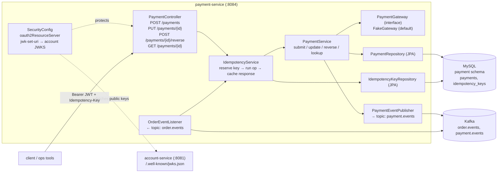

# Plan: Payment Service (Phase E)

## Context

Plans A–D already exist. Phase A sets up the multi-module layout + infra
compose. Phase B stands up Account + JWKS. Phase C stands up Item + atomic
inventory. Phase D stands up Order, which **produces** `order.events` and
**consumes** `payment.events`. Phase D's consumer was tested against
hand-published Kafka messages because no service publishes them yet.

Phase A's "phases beyond" list names **Phase E = Payment Service**, and
`docs/requirement.md` pins the scope:

- Four operations — *Submit*, *Update*, *Reverse* (refund), *Lookup*.
- Integrates with Order via REST (for sync Lookup) and via Kafka
  (subscribes to `OrderCreated`, publishes `PaymentSucceeded` /
  `PaymentFailed`).
- **Idempotency is a hard requirement** — no double charges, no double
  refunds. This is the single most important design property of this
  service and drives the schema.
- MySQL is the mandated relational store; Account already uses a separate
  schema on the same MySQL container, so Payment gets its own schema
  `payment` (Phase A's `docker/mysql/init.sql` already creates it).

End state after this PR:
- `payment-service` persists payments + idempotency records in MySQL
  (`payments`, `idempotency_keys`), migrated by Flyway.
- REST API: `POST /payments` (Submit), `PUT /payments/{id}` (Update),
  `POST /payments/{id}/reverse` (Refund), `GET /payments/{id}` (Lookup).
  Every mutating endpoint requires an `Idempotency-Key` header and is
  idempotent by construction.
- Kafka consumer on `order.events` handles `OrderCreated` by auto-
  submitting a payment for the order (the shopping flow spec implies
  payment is triggered by order creation).
- Kafka producer emits `PaymentSucceeded` / `PaymentFailed` on `payment.
  events`. Phase D's order-service flips the order state in response.
- A deliberately-simple **payment gateway adapter** (`FakeGateway`) is the
  default in dev/test; the interface is written so a real gateway can drop
  in later without touching the service.
- Service-layer Jacoco coverage ≥ 30%.
- `docker compose up` still green; end-to-end: register → login → seed
  item + stock → place order → payment auto-submits → order flips to
  `Paid`/`Completed` → stock stays reserved.

**Prerequisite:** Phases A–D must have landed. This plan reads the topic
contract in `docs/events.md` (introduced in Phase D) and writes the
publisher side of `payment.events`.

## Shape of the change



Key design choices (picked so reviewers can see them up front):

- **Idempotency lives in a dedicated table, not as a smart unique index
  on `payments`.** The row records: `key` (PK, client-supplied string),
  `request_fingerprint` (SHA-256 of canonical request body), `status`
  (`IN_PROGRESS`/`COMPLETED`/`FAILED`), `response_body`, `response_status`,
  `created_at`, `completed_at`. This lets us (a) replay the exact original
  response on retries, (b) reject "same key, different body" with 422,
  (c) detect in-flight duplicates (client retried mid-flight). A unique
  index on `payments.idempotency_key` alone cannot distinguish these.
- **Kafka-triggered submits also go through the same idempotency path.**
  The consumer uses `"order:" + orderId` as the key. Replays of
  `OrderCreated` therefore *cannot* produce a second payment for the same
  order. This matters because Kafka is at-least-once.
- **Gateway is an interface, default `FakeGateway` is deterministic.**
  Submit succeeds except when a magic amount (e.g. `priceCents = 13`) is
  used — that forces a `PaymentFailed` path so tests and demos can
  exercise both outcomes. A real gateway (Stripe, etc.) is out of scope.
- **All monetary amounts in minor units (`long amountCents`) + currency
  code.** Matches Item service's convention from Phase C. No
  `BigDecimal`/`Money` library; simplest thing that avoids rounding
  ambiguity.
- **Reverse (refund) creates a linked `Payment` row of type `REFUND`,
  not an in-place update.** Preserves audit trail; the original charge
  row is immutable once `COMPLETED`. `GET /payments/{id}` returns the
  row plus any linked refunds.
- **Update semantics.** The spec says "Update Payment" but doesn't
  specify what's updatable on a completed charge. We allow update **only
  while status = `PENDING`** (i.e. before the gateway call fires, or the
  very narrow window where we've persisted the request but not yet
  dispatched). Anything else returns 409. This keeps audit clean and
  avoids inventing semantics the spec doesn't demand.
- **Shared `common-auth` module: extract in this PR.** Item, Order,
  Payment all now carry near-identical `SecurityConfig` + `application.
  yml` JWT blocks. That's the three call sites Phase C/D deferred for.
  Extracting is cheap now and tax later. See §8 below.

## Files to change

Paths assume the Phase A layout (`payment-service/` module exists with the
HealthController skeleton and Phase A's `pom.xml`).

### 1. `payment-service/pom.xml`

Add starters (versions managed by parent's Spring Boot BOM):
- `spring-boot-starter-data-jpa`
- `spring-boot-starter-web` (Phase A)
- `spring-boot-starter-security`
- `spring-boot-starter-oauth2-resource-server`
- `spring-boot-starter-validation`
- `spring-kafka`
- `com.mysql:mysql-connector-j` (runtime)
- `org.flywaydb:flyway-core`, `org.flywaydb:flyway-mysql`
- `org.springdoc:springdoc-openapi-starter-webmvc-ui`
- `com.shopping.emarket:common-auth:${project.version}` — the shared
  module introduced in §8.
- test: `com.h2database:h2`, `spring-kafka-test` (EmbeddedKafka),
  `spring-security-test`, `org.testcontainers:mysql`,
  `org.testcontainers:junit-jupiter`.

### 2. `payment-service/src/main/java/com/shopping/emarket/payment/`

```
domain/
  Payment.java              @Entity payments:
                            id (UUID), orderId (UUID, indexed),
                            userId (UUID), amountCents (long), currency,
                            type (enum CHARGE|REFUND),
                            status (enum PENDING|SUCCEEDED|FAILED),
                            gatewayRef (String nullable),
                            originalPaymentId (UUID nullable — for REFUND),
                            failureReason (String nullable),
                            createdAt, updatedAt, completedAt
                            (@Version for optimistic locking)
  IdempotencyKey.java       @Entity idempotency_keys:
                            key (String PK, e.g. "order:<uuid>" or
                              UUID from client header),
                            requestFingerprint (CHAR(64), SHA-256 hex),
                            status (enum IN_PROGRESS|COMPLETED|FAILED),
                            responseStatus (int nullable),
                            responseBody (TEXT nullable),
                            paymentId (UUID nullable — the resulting row),
                            createdAt, completedAt
  PaymentStatus.java        enum
  PaymentType.java          enum
repo/
  PaymentRepository.java    extends JpaRepository<Payment, UUID>;
                            List<Payment> findByOriginalPaymentId(UUID);
                            Optional<Payment> findByOrderIdAndType(UUID,
                              PaymentType);  // idempotency guard:
                                             // at most one CHARGE per order
  IdempotencyKeyRepository.java
                            extends JpaRepository<IdempotencyKey, String>
service/
  PaymentService.java       submit(SubmitPaymentRequest req, String userSub)
                              → constructs Payment(status=PENDING), saves,
                                calls gateway, updates status + gatewayRef,
                                emits PaymentSucceeded or PaymentFailed,
                                returns PaymentResponse.
                            update(UUID id, UpdatePaymentRequest)
                              → 409 unless status==PENDING.
                            reverse(UUID id, ReverseRequest)
                              → 409 unless original status==SUCCEEDED;
                                409 if a non-FAILED refund already exists
                                for this original (cannot double-refund);
                                creates linked Payment(type=REFUND), calls
                                gateway.refund, persists, emits event.
                            lookup(UUID id)
                              → Payment + linked refunds.
                            submitForOrder(OrderCreated event)
                              → called by consumer; idempotency key =
                                "order:" + event.orderId; derives amount
                                from event.subtotalCents; userId from
                                event.userId.
  IdempotencyService.java   <T> execute(String key, Object requestBody,
                                        Supplier<T> op,
                                        Function<T,PersistedResponse> mapper)
                            Steps (single transaction when possible):
                              1. Compute fingerprint.
                              2. Try insert IdempotencyKey(IN_PROGRESS,
                                 fingerprint); on unique-constraint hit,
                                 reload row:
                                   - IN_PROGRESS → 409 CONFLICT retry later
                                     (client is racing itself).
                                   - COMPLETED + same fingerprint → replay
                                     stored responseStatus + responseBody.
                                   - COMPLETED + different fingerprint →
                                     422 UNPROCESSABLE (key reuse with
                                     different body).
                                   - FAILED → allow retry: update row to
                                     IN_PROGRESS, re-run op.
                              3. Run op(); on success, update row to
                                 COMPLETED + stored response; on exception,
                                 mark FAILED and rethrow.
  exception/
    PaymentNotFoundException, IllegalPaymentTransitionException,
    AlreadyRefundedException, IdempotencyConflictException,
    IdempotencyKeyReusedException, GatewayException.
gateway/
  PaymentGateway.java       interface:
                              GatewayResult charge(ChargeRequest);
                              GatewayResult refund(RefundRequest);
                            GatewayResult = sealed (Success(ref),
                              Failure(code, message)).
  FakeGateway.java          @Component @ConditionalOnProperty(
                              "emarket.payment.gateway"="fake",
                              matchIfMissing=true).
                            Succeeds for all amounts except amountCents==13
                            (forces Failure("TEST_FAILURE", …)) so the
                            failure path can be demoed without mocking.
kafka/
  PaymentEventPublisher.java KafkaTemplate, topic "payment.events",
                             key = orderId, JSON value with "type"
                             discriminator; mirrors Phase D's contract in
                             `docs/events.md`.
  OrderEventListener.java    @KafkaListener(topics="order.events",
                               groupId="payment-service");
                             only acts on type=="OrderCreated"; delegates
                             to PaymentService.submitForOrder via
                             IdempotencyService with key "order:" + orderId.
                             Ignores OrderCancelled/OrderCompleted (Payment
                             doesn't need them in this phase).
  events/
    OrderEvent.java          mirrors Phase D's DTOs (parser-side).
    PaymentEvent.java        producer records: PaymentSucceeded,
                             PaymentFailed.
web/
  PaymentController.java    POST /payments (requires Idempotency-Key
                              header, validated);
                            PUT /payments/{id} (requires Idempotency-Key);
                            POST /payments/{id}/reverse (requires
                              Idempotency-Key);
                            GET /payments/{id}.
                            userId taken from JWT `sub`; callers can only
                            read their own payments (unless role=ADMIN —
                            still deferred, same as Order).
  GlobalExceptionHandler.java  @ControllerAdvice:
                            PaymentNotFoundException → 404,
                            IllegalPaymentTransitionException → 409,
                            AlreadyRefundedException → 409,
                            IdempotencyConflictException → 409,
                            IdempotencyKeyReusedException → 422,
                            GatewayException → 502,
                            MissingRequestHeaderException (missing
                              Idempotency-Key) → 400,
                            MethodArgumentNotValidException → 400.
config/
  JpaConfig.java            @EnableJpaAuditing.
  KafkaConfig.java          producer + consumer JSON configs; DLT
                             `order.events.dlt` for poison messages on the
                             inbound side.
  SecurityConfig.java       thin — delegates to common-auth's builder
                            (see §8). Declares: /actuator/health,
                            /v3/api-docs/**, /swagger-ui/** → permitAll;
                            everything else authenticated.
dto/
  SubmitPaymentRequest.java (records): orderId (UUID), amountCents
                            (@Positive), currency (@Size 3), method
                            (CARD|PAYPAL|…).
  UpdatePaymentRequest.java
  ReverseRequest.java       amountCents nullable (default = full refund),
                            reason (String).
  PaymentResponse.java      id, orderId, userId, amountCents, currency,
                            type, status, gatewayRef, failureReason,
                            refunds: [PaymentResponse].
```

### 3. `payment-service/src/main/resources/`

- `application.yml` — replace the Phase A stub:
  ```yaml
  server.port: 8084
  spring:
    application.name: payment-service
    datasource:
      url: ${SPRING_DATASOURCE_URL:jdbc:mysql://localhost:3306/payment}
      username: ${SPRING_DATASOURCE_USERNAME:root}
      password: ${SPRING_DATASOURCE_PASSWORD:root}
    jpa:
      hibernate.ddl-auto: validate
      open-in-view: false
    flyway.enabled: true
    kafka:
      bootstrap-servers: ${SPRING_KAFKA_BOOTSTRAP_SERVERS:localhost:9092}
      consumer:
        group-id: payment-service
        auto-offset-reset: earliest
      producer:
        key-serializer: org.apache.kafka.common.serialization.StringSerializer
        value-serializer: org.apache.kafka.common.serialization.StringSerializer
    security.oauth2.resourceserver.jwt:
      issuer-uri: ${EMARKET_JWT_ISSUER:http://account-service:8081}
      jwk-set-uri: ${EMARKET_JWT_JWK_SET_URI:http://account-service:8081/.well-known/jwks.json}
  emarket:
    payment.gateway: ${EMARKET_PAYMENT_GATEWAY:fake}
  management.endpoints.web.exposure.include: health
  springdoc.swagger-ui.path: /swagger-ui.html
  ```
- `db/migration/V1__init.sql` — MySQL DDL for `payments` (indexes on
  `order_id`, `original_payment_id`) and `idempotency_keys`
  (`key` PK, index on `status`).

### 4. `payment-service/src/test/java/com/shopping/emarket/payment/`

Cover the service layer to clear 30% Jacoco; the tricky correctness
properties (idempotency replay, refund prevention, consumer once-only)
get dedicated tests.

- `service/IdempotencyServiceTest.java` (`@DataJpaTest` + H2) —
  first call runs op and stores response; second call with **same**
  key + same body returns stored response *without* re-running op
  (assert op invocation count); second call with **same key + different
  body** → `IdempotencyKeyReusedException` (422 mapping); in-flight
  second call (row IN_PROGRESS) → `IdempotencyConflictException` (409).
- `service/PaymentServiceTest.java` (Mockito) —
  - `submit` happy path: gateway returns Success → SUCCEEDED, publisher
    gets `PaymentSucceeded`.
  - `submit` gateway Failure → FAILED row persisted, publisher gets
    `PaymentFailed`, endpoint returns 200 with status=FAILED (a failed
    charge is not an API error).
  - `update` on non-PENDING → throws `IllegalPaymentTransitionException`.
  - `reverse` on SUCCEEDED charge → REFUND row created, gateway.refund
    called, publisher emits `PaymentSucceeded` (type=REFUND).
  - `reverse` on already-refunded charge → throws
    `AlreadyRefundedException` (even without the idempotency layer).
  - `reverse` on FAILED charge → 409.
  - `submitForOrder` with a duplicate `OrderCreated`: second call
    returns the existing payment (via IdempotencyService) and does **not**
    emit a second event. Assertion: exactly one `send` on the publisher.
- `kafka/OrderEventListenerTest.java` — `@SpringBootTest` +
  `EmbeddedKafka`: publish two identical `OrderCreated` JSONs on
  `order.events`; assert exactly one `payments` row persisted and exactly
  one `PaymentSucceeded` on `payment.events` (uses a small test consumer
  attached to the embedded broker).
- `gateway/FakeGatewayTest.java` — amountCents 100 → Success; amountCents
  13 → Failure("TEST_FAILURE", …).
- `web/PaymentControllerTest.java` — `@WebMvcTest`:
  - `POST /payments` without `Idempotency-Key` → 400.
  - `POST /payments` unauthenticated → 401.
  - `POST /payments` happy path with JWT + key → 201.
  - `POST /payments` same key, same body, twice → identical 201 + same
    payment id both times (replay path).
  - `POST /payments/{id}/reverse` happy path → 201 with refund row.
- `repo/PaymentRepositoryIT.java` — `@Testcontainers` with `mysql:8`:
  Flyway runs, `findByOrderIdAndType(orderId, CHARGE)` returns the
  inserted row, unique constraint on `idempotency_keys.key` holds.
  Tagged `integration`, excluded from fast local loops.

### 5. `docker/docker-compose.yml` (edit the Phase A file)

Under the existing `payment-service` entry add:
- `depends_on:`
  ```
  mysql:          { condition: service_healthy }
  kafka:          { condition: service_started }
  account-service:{ condition: service_started }
  ```
- `environment:`
  ```
  SPRING_DATASOURCE_URL: jdbc:mysql://mysql:3306/payment
  SPRING_DATASOURCE_USERNAME: root
  SPRING_DATASOURCE_PASSWORD: root
  SPRING_KAFKA_BOOTSTRAP_SERVERS: kafka:9092
  EMARKET_JWT_ISSUER: http://account-service:8081
  EMARKET_JWT_JWK_SET_URI: http://account-service:8081/.well-known/jwks.json
  EMARKET_PAYMENT_GATEWAY: fake
  ```

No new infra containers — `mysql` already has a `payment` schema from
Phase A's `docker/mysql/init.sql`.

### 6. `docs/events.md` (edit — add publisher-side)

Phase D introduced the file with the `payment.events` schema "published by
Phase E". This PR flips that from intent to fact, and adds a note under
`payment.events` that replays of `OrderCreated` on the consumer side will
**not** produce duplicate `PaymentSucceeded` messages (enforced by
`IdempotencyService`).

### 7. Root `README.md` (append)

"End-to-end checkout" quickstart — this is the point where the whole
system is demonstrable:
```
# Phase B
TOKEN=$(curl -sX POST localhost:8081/auth/token ... | jq -r .accessToken)
# Phase C
curl -sX POST localhost:8082/items -H "authorization: Bearer $TOKEN" ...
curl -sX PUT  localhost:8082/items/$ITEM/inventory \
  -H "authorization: Bearer $TOKEN" -d '{"available":10}'
# Phase D
curl -sX POST localhost:8083/orders -H "authorization: Bearer $TOKEN" \
  -d "{\"lines\":[{\"itemId\":\"$ITEM\",\"quantity\":1}]}"
# Phase E — happens automatically via Kafka; verify:
curl -s -H "authorization: Bearer $TOKEN" localhost:8083/orders/$ORDER \
  | jq '.status'       # should be "COMPLETED" within ~1s
docker compose exec kafka kafka-console-consumer.sh \
  --bootstrap-server localhost:9092 --topic payment.events \
  --from-beginning --max-messages 1
# Direct payment API (for ops/demo):
curl -sX POST localhost:8084/payments \
  -H "authorization: Bearer $TOKEN" \
  -H "idempotency-key: $(uuidgen)" \
  -H 'content-type: application/json' \
  -d '{"orderId":"...","amountCents":1999,"currency":"USD","method":"CARD"}'
```

### 8. New module `common-auth/`

This is the one piece of architecture this PR *introduces* rather than
just building on.

Why now: Item (Phase C), Order (Phase D), and Payment (Phase E) all have
near-identical `SecurityConfig` + `application.yml` JWT blocks. Phase C
explicitly deferred extraction until a second call site; Phase D deferred
it again pending a third. This PR has the third. Extracting avoids three
copies of the same filter config drifting apart.

What's in it (minimal):
```
common-auth/
  pom.xml                       inherits parent; depends on
                                spring-boot-starter-security,
                                spring-boot-starter-oauth2-resource-server.
                                Does NOT pull in starter-web (so it can be
                                used by non-web services later).
  src/main/java/com/shopping/emarket/common/auth/
    JwtResourceServerSupport.java
      public static SecurityFilterChain defaultChain(HttpSecurity http,
        Customizer<AuthorizeHttpRequestsConfigurer<HttpSecurity>.
          AuthorizationManagerRequestMatcherRegistry> permits)
        // applies CSRF-disable, stateless session, the permits block,
        // anyRequest().authenticated(), oauth2ResourceServer(jwt()).
    JwtPrincipal.java
      record wrapping Jwt with helpers: userId() → UUID.fromString(sub),
      email() → claim lookup.
```
Each service's `SecurityConfig` becomes ~10 lines calling
`JwtResourceServerSupport.defaultChain(http, a -> a.requestMatchers(...).
permitAll())`.

Refactor scope in this PR:
- Item and Order are edited to use `common-auth`.
- Payment adopts it from day one.
- Phase A's parent POM gains `<module>common-auth</module>` (update the
  order so it builds before the services that depend on it).

This keeps the PR focused: one new service + one shared utility *with a
proven rationale*. Not a speculative "common" dumping ground.

## Execution order

1. Add parent `<module>common-auth</module>` and write `common-auth/`:
   `pom.xml`, `JwtResourceServerSupport`, `JwtPrincipal`. One smoke test
   that building the chain doesn't throw.
2. Refactor Item's and Order's `SecurityConfig` to use it. Run each
   module's existing tests — they must still pass before Payment adds
   complexity.
3. Add starters to `payment-service/pom.xml`. `./mvnw -pl payment-service
   dependency:tree` confirms flyway, spring-kafka, oauth2-resource-server,
   common-auth on path.
4. Write `V1__init.sql` + entities + repositories + `PaymentRepositoryIT`
   (Testcontainers MySQL). Green before service on top.
5. Write `PaymentGateway` + `FakeGateway` + `FakeGatewayTest`.
6. Write `IdempotencyService` + its test **first** — this is the property
   the whole service hangs on. Drive out the state machine
   (IN_PROGRESS / COMPLETED / FAILED + same-body-replay + mismatched-body-
   422) via tests.
7. Write `PaymentEventPublisher` + its test; write `PaymentService.
   submit / update / reverse / lookup / submitForOrder` + unit tests
   (gateway-failure path and "no double refund" are the sharp ones).
8. Write `OrderEventListener` + `EmbeddedKafka` double-delivery test
   (exactly-one persist + exactly-one emit).
9. Write `SecurityConfig` (common-auth builder), `PaymentController`,
   `GlobalExceptionHandler`, DTOs, `@WebMvcTest`s (idempotency replay
   through the HTTP layer).
10. `./mvnw -pl payment-service clean verify` — green, Jacoco ≥ 30% on
    `service/`.
11. Update compose env; `docker compose up --build -d` and walk the
    README end-to-end flow against the live stack.
12. Open the PR; move this plan to `docs/Plan Phase E.md` as part of the
    commit.

## Verification

- `./mvnw clean verify` passes at the root (all modules, including the
  refactored Item/Order). Jacoco HTML at `payment-service/target/site/
  jacoco/index.html` shows `service/` ≥ 30%.
- `docker compose up --build -d` then, from the host:
  - `curl -fsS localhost:8084/actuator/health` → `{"status":"UP"}`.
  - README end-to-end flow: register → login → seed item → stock →
    `POST /orders` → within ~1 s, `GET /orders/{id}.status == COMPLETED`,
    Payment row exists with status=SUCCEEDED, `payment.events` shows one
    `PaymentSucceeded`.
  - **Gateway-failure path**: create an item with `priceCents=13`, place
    an order for quantity 1 → order flips to `CANCELLED`, Payment row
    status=FAILED, `payment.events` shows `PaymentFailed`, and Item's
    inventory is released (Phase D owns the compensation).
  - **Idempotency replay**:
    `key=$(uuidgen); for i in 1 2 3; do curl -sX POST localhost:8084/
    payments -H "idempotency-key: $key" -H "authorization: Bearer $TOKEN"
    -d '<same body>'; done` → all three responses identical, and
    `select count(*) from payments where order_id=…` returns 1.
  - **Mismatched body replay**: same key, different amount → 422.
  - **Refund**: `POST /payments/{id}/reverse` with fresh idempotency key
    → 201; second call with fresh key → 409 `AlreadyRefundedException`.
- Cross-service sanity:
  - Publish a second identical `OrderCreated` via
    `kafka-console-producer.sh` → no second Payment row, no second
    `PaymentSucceeded` emitted (consumer idempotency holds).
  - Stop `payment-service`, place an order → Order stays `CREATED`
    (Phase D's state). Restart `payment-service` → consumer picks up
    the backlog (`auto-offset-reset=earliest`, `groupId` stable) and
    order transitions through `PAID → COMPLETED`.
- Negative checks:
  - `POST /payments` without `Idempotency-Key` → 400.
  - `POST /payments` without bearer → 401.
  - `GET /payments/{id}` for another user's payment → 403 (or 404 if we
    prefer not to leak existence — plan choice: return 404 to minimise
    info leak, matches Order's stance).
  - `PUT /payments/{id}` on a SUCCEEDED row → 409.

## Out of scope (explicitly deferred)

- Real payment gateway integration (Stripe/Adyen/PayPal SDK) — gateway
  interface is in place; swap implementations in Phase F or later.
- Refresh tokens, webhooks from the gateway, 3-D Secure, SCA — Phase F.
- Fee/tax handling, multi-currency conversion, split payments — not in
  spec.
- Admin endpoints (reverse on behalf of user, list all payments,
  reconciliation report) — single `ROLE_USER` still.
- Partial refunds across multiple refund rows (we support partial, single
  refund via `ReverseRequest.amountCents`; multiple partials on the same
  original is deferred — spec says "Reverse Payment: Refund", singular).
- Retry / DLQ tuning on the inbound `order.events` consumer — default
  Spring Kafka retry + `order.events.dlt` is baseline; Phase F tunes it.
- Outbox / transactional messaging — current design publishes the Kafka
  event *after* the DB commit. Failure window is small but real; if a
  test run surfaces it we'll add an outbox in Phase F.
- Shared `common-events` module with DTOs for `OrderEvent`/`PaymentEvent`
  — deferred. JSON-with-`type`-discriminator keeps Order and Payment
  independently deployable; extracting only buys us stronger types at
  the cost of tighter coupling. Revisit in Phase F if schema drift
  actually hurts.
