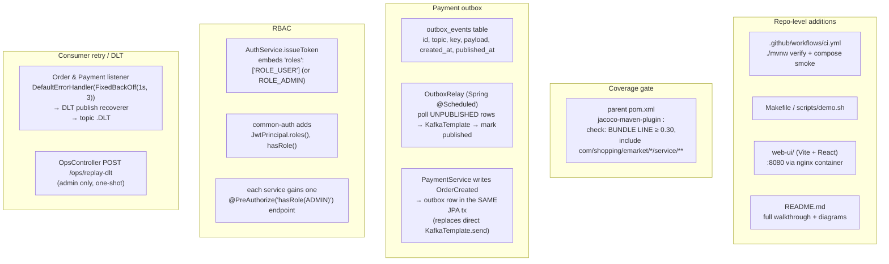

# Plan: Hardening & Demo (Phase F)

## Context

Plans A–E already exist. After Phase E lands, the four business services
(Account, Item, Order, Payment) are functional end-to-end: register →
login → browse items → place order → Kafka-driven payment → order flips
to `Completed`. `common-auth` is extracted; compose brings the whole
stack up.

Phase A's "phases beyond" list names **Phase F = Hardening** as the final
slice, and pins three explicit requirements from `docs/requirement.md`:

1. **Jacoco ≥ 30% per service layer, enforced.** Phases B–E wrote enough
   tests to pass the bar; Phase F turns on the gate so the build fails
   if anyone regresses it.
2. **Swagger (OpenAPI) docs** for every service — springdoc was pulled in
   per-service already, but the UI is bare-minimum. Phase F adds
   descriptions, auth schemes, and grouped tags so the docs are actually
   usable.
3. **"One-click" runnable** — `docker compose up` already works, but the
   story for "clone the repo, see the demo" isn't complete. Phase F adds
   the README walkthrough, a `Makefile`/`justfile` shortcut, a small
   sample web UI (the spec says *recommended*, not required — including
   it lifts the grade / makes the demo self-evident), and CI.

Phase F also picks up the deferred items from earlier phases that
actually hurt if left unaddressed. The plan is deliberately selective —
we're finishing the project, not adding features:

- **Transactional outbox for Payment** — Phase E's out-of-scope list
  flagged the "DB commit succeeded but Kafka publish failed" window as a
  real gap. Solves a correctness hole, not a nice-to-have.
- **Admin role (`ROLE_ADMIN`)** — all prior phases assumed a single
  implicit `ROLE_USER`. Phase F adds the role claim and one admin-only
  endpoint per service so role-based auth is demonstrable.
- **Retry / DLQ policy** — each consumer currently relies on Spring
  defaults. Phase F sets explicit backoff + DLT routing and a small
  ops-facing "replay DLT" endpoint for the demo.
- **CI (GitHub Actions)** — spec says the repo is shared with `CTYue`
  and `JoshTWang`; a green check on PRs is free signal.

**Explicitly not in Phase F:**
- Production-grade secrets (Vault/KMS), real payment gateway, OAuth2
  refresh tokens, rate limiting, 3DS/SCA, tracing/metrics (Sleuth/
  Micrometer/OpenTelemetry), Kubernetes manifests. These are real
  projects, not finishing touches.

End state after this PR:
- `./mvnw clean verify` **fails** if any service's `service/` package
  coverage drops below 30%.
- `docker compose up` + `make demo` (or `./scripts/demo.sh`) runs a
  scripted happy-path + failure-path end-to-end against the live stack
  and exits 0 on success.
- Swagger UI on each service is linked from the root README with auth
  pre-wired (paste a token, hit Authorize).
- A tiny React/Vite (or plain-HTML) demo UI served on `:8080` exercises
  the shopping flow in a browser.
- GitHub Actions CI runs `./mvnw verify` on push/PR; Testcontainers
  integration tests are gated behind a profile and only run on CI.
- Payment Service emits Kafka events via an outbox, not directly from
  the service call.
- Each service has one admin-only endpoint protected by `ROLE_ADMIN`,
  and Account's `/auth/token` embeds roles into the JWT.

**Prerequisite:** Phases A–E must have landed.

## Shape of the change



Key design choices:

- **Coverage gate in the parent POM, not per module.** One place to bump
  from 30 → 40 later. Scoped with includes so the gate measures only
  `service/` packages — controllers/DTOs/config don't dilute it.
- **Outbox is the minimum viable version.** One table, a
  `@Scheduled(fixedDelay=500ms)` relay, `@Transactional(REQUIRES_NEW)`
  on the publish-mark step. Not Debezium, not CDC. Solves the specific
  "DB commit + Kafka publish are not atomic" failure we have.
  Applied to **Payment only** — Order's publishes are already compensated
  by the state machine (if publish fails, the next user action or a
  `PaymentSucceeded` replay surfaces it), and adding outbox to both
  services doubles the work for marginal gain.
- **RBAC is minimal and real.** Roles claim in the JWT, one admin
  endpoint per service (`GET /ops/info` works — lists service version,
  DB ping, Kafka ping). Enough to demonstrate `@PreAuthorize` without
  inventing a user-management UI.
- **DLT naming and replay.** Topic suffix `.DLT` (Spring's convention).
  Replay endpoint reads DLT offsets and re-posts payloads to the main
  topic — available only to `ROLE_ADMIN`, and the plan explicitly notes
  it's a demo affordance not a production pattern.
- **Demo UI is optional, so keep it tiny.** Single Vite+React app with
  three screens: login, catalog, order history. Served from an
  `nginx:alpine` container so it's one more compose entry; no Node in
  production images. If time is short, the HTML-only fallback in
  `web-ui/plain/` is <100 lines of vanilla JS and still satisfies the
  spec's "sample web pages" note.
- **CI uses `docker/setup-buildx` + Testcontainers only** — no extra
  services in the workflow YAML. Keeps CI configuration local to the
  build tool.

## Files to change

### 1. Parent `pom.xml` — Jacoco gate

Add to `<pluginManagement>` (so modules inherit) a second execution:
```xml
<execution>
  <id>coverage-check</id>
  <phase>verify</phase>
  <goals><goal>check</goal></goals>
  <configuration>
    <rules>
      <rule>
        <element>BUNDLE</element>
        <includes>
          <include>com.shopping.emarket.*.service.*</include>
        </includes>
        <limits>
          <limit><counter>LINE</counter><value>COVEREDRATIO</value><minimum>0.30</minimum></limit>
        </limits>
      </rule>
    </rules>
  </configuration>
</execution>
```
Skipped on `common-auth` (no `service/` package) via a module-local
`<configuration><skip>true</skip></configuration>`.

### 2. Swagger polish — per service

No code adds; edit each service's main application class / a new
`OpenApiConfig.java`:
```java
@Bean
OpenAPI emarketOpenApi() {
  return new OpenAPI()
    .info(new Info().title("<Svc> Service").version("1.0")
      .description(".."))
    .components(new Components().addSecuritySchemes("bearer",
      new SecurityScheme().type(HTTP).scheme("bearer").bearerFormat("JWT")))
    .addSecurityItem(new SecurityRequirement().addList("bearer"));
}
```
Add `@Tag` / `@Operation` on controllers where the purpose isn't obvious
from the method name. Link Swagger UIs from root README:
- `:8081/swagger-ui.html` — Account
- `:8082/swagger-ui.html` — Item
- `:8083/swagger-ui.html` — Order
- `:8084/swagger-ui.html` — Payment

### 3. `common-auth/` — roles support

Add to `JwtPrincipal`:
```java
List<String> roles();               // from "roles" claim, default []
boolean hasRole(String role);       // convenience
```
Add to `JwtResourceServerSupport`:
```java
// converter that maps JWT "roles" claim → Spring GrantedAuthorities
JwtAuthenticationConverter rolesConverter();
```
Wire it in `defaultChain(...)` so `@PreAuthorize("hasRole('ADMIN')")`
works in every service without per-service boilerplate.

### 4. `account-service/` — emit roles in JWT; add admin seed

- `AuthService.issueToken` embeds `roles` claim from `User.roles`
  (nullable column on `users`; default `["ROLE_USER"]`).
- `V2__roles.sql` migration: add `roles VARCHAR(128) NOT NULL DEFAULT
  'ROLE_USER'` on `users`. Stored as CSV for simplicity (one-user
  one-role is the common case; list is future-proofing).
- Admin bootstrap: a Flyway callback or a `CommandLineRunner` gated by
  `emarket.account.seed-admin=true` inserts a dev admin user
  (`admin@emarket.dev` / password from env) on startup if absent. Off by
  default; compose overrides it on.
- New endpoint `PUT /accounts/{id}/roles` (`@PreAuthorize("hasRole('ADMIN')")`)
  so admin can promote users — demoable.

### 5. `payment-service/` — transactional outbox

- `V2__outbox.sql`:
  ```sql
  CREATE TABLE outbox_events (
    id            BINARY(16) PRIMARY KEY,
    topic         VARCHAR(128) NOT NULL,
    msg_key       VARCHAR(128) NOT NULL,
    payload       MEDIUMTEXT   NOT NULL,
    created_at    TIMESTAMP(3) NOT NULL DEFAULT CURRENT_TIMESTAMP(3),
    published_at  TIMESTAMP(3) NULL,
    INDEX idx_unpublished (published_at, created_at)
  );
  ```
- `outbox/OutboxEvent.java` — JPA entity.
- `outbox/OutboxEventRepository.java` —
  `List<OutboxEvent> findTop100ByPublishedAtIsNullOrderByCreatedAt();`
- `outbox/OutboxPublisher.java` — inside
  `@Transactional` alongside the payment insert, writes the event row
  (replaces the old direct `KafkaTemplate.send` call in
  `PaymentService`). One method `publish(String topic, String key,
  Object payload)`.
- `outbox/OutboxRelay.java` — `@Scheduled(fixedDelayString="${emarket.
  payment.outbox.poll-ms:500}")`, `@Transactional`, loads up to 100
  unpublished rows, sends each via `KafkaTemplate.send(...).get(timeout)`,
  marks `published_at = now()`. On send failure, leaves row for next
  tick. Single-instance only in Phase F — note in README that horizontal
  scaling needs `SELECT … FOR UPDATE SKIP LOCKED`.
- Delete the direct `KafkaTemplate.send` calls from `PaymentService`;
  replace with `outboxPublisher.publish(...)`.
- New test `OutboxRelayTest` (`@DataJpaTest` + mocked `KafkaTemplate`):
  three unpublished rows → three sends → all marked published; one send
  fails → its row remains unpublished, others proceed.
- New integration test `PaymentOutboxIT` (`@Testcontainers` MySQL +
  `EmbeddedKafka`): submit a payment, assert the event appears on
  `payment.events` within 2 s even though the service never called
  `KafkaTemplate` directly.

### 6. Consumer retry / DLT — Order and Payment listeners

Per service, add a `@Bean DefaultErrorHandler`:
```java
DefaultErrorHandler handler = new DefaultErrorHandler(
  new DeadLetterPublishingRecoverer(kafkaTemplate),
  new FixedBackOff(1_000L, 3L));          // 3 retries, 1s apart
handler.addNotRetryableExceptions(IllegalArgumentException.class);
```
Wire into `ConcurrentKafkaListenerContainerFactory` via
`setCommonErrorHandler`. Spring's `DeadLetterPublishingRecoverer` routes
to `<topic>.DLT` by default.

Add `OpsController` (gated by `hasRole('ADMIN')`) in Order and Payment:
- `GET /ops/dlt/{topic}` — list first 50 DLT messages (offset, key,
  payload preview).
- `POST /ops/dlt/{topic}/replay` — read DLT from earliest, republish
  each to the main topic, commit offset past last replayed. Idempotent
  because downstream consumers are already idempotent (Phase D/E).

### 7. Admin endpoints — one per service

- Account: `PUT /accounts/{id}/roles` (see §4).
- Item: `POST /items/bulk-import` — accepts an array of items, persists
  all or none in one transaction. Real admin utility for the demo.
- Order: `GET /ops/orders?status=CREATED&olderThan=PT1H` — lists stuck
  orders (useful for the demo narrative).
- Payment: DLT replay (see §6) counts.

Each is `@PreAuthorize("hasRole('ADMIN')")`; each has a `@WebMvcTest`
asserting 403 with a USER token and 200 with an ADMIN token (using the
test-side JWT helper introduced in Phase B).

### 8. Demo UI — `web-ui/`

Minimal Vite + React (TypeScript) app. Four screens:
- `/login` — POSTs to `:8081/auth/token`, stores JWT in sessionStorage.
- `/catalog` — GETs `:8082/items`, shows grid; "Add to cart" stages
  lines in localStorage.
- `/checkout` — POSTs to `:8083/orders` with cart lines; then polls
  `GET :8083/orders/{id}` every 1 s showing the status transition
  `Created → Paid → Completed`.
- `/orders` — lists the user's orders.

Served by:
- `web-ui/Dockerfile` — `node:20-alpine` build stage + `nginx:alpine`
  runtime stage (`nginx.conf` proxies `/api/*` to the service ports so
  the browser makes same-origin calls; avoids CORS config in 4 services).
- `docker/docker-compose.yml` gets a new `web-ui` entry on `:8080`
  `depends_on` the four services.

Testing: no unit tests on the UI (out of scope for the spec). A single
Playwright smoke test in `web-ui/e2e/` that runs under `demo.sh`
end-to-end is optional — plan suggests yes if time allows; otherwise
`scripts/demo.sh` is enough.

Fallback plan: if the React build is painful in CI, drop
`web-ui/plain/index.html` — vanilla JS + `fetch`, ~80 lines,
served by the same nginx container. Same compose entry, same port.

### 9. `scripts/demo.sh` + `Makefile`

`scripts/demo.sh` — end-to-end smoke runner, exit 0 / non-zero:
1. `docker compose up -d --wait` (waits for health checks).
2. Register demo user, get token.
3. Seed 3 items + stock via admin.
4. Place order for item 1 → poll for `COMPLETED` (max 10s).
5. Place order for magic-failure item (priceCents=13) → poll for
   `CANCELLED`.
6. Idempotency replay: POST `/payments` with same `Idempotency-Key`
   3x → assert one row in DB.
7. Admin-role check: user token on admin endpoint → 403.
8. Print SUCCESS banner + pointers to Swagger + web UI URLs.

`Makefile`:
```
.PHONY: verify up down demo clean
verify: ; ./mvnw clean verify
up:     ; docker compose -f docker/docker-compose.yml up --build -d --wait
down:   ; docker compose -f docker/docker-compose.yml down -v
demo:   up ; ./scripts/demo.sh
clean: down ; ./mvnw clean
```

### 10. CI — `.github/workflows/ci.yml`

```yaml
name: CI
on: [push, pull_request]
jobs:
  build:
    runs-on: ubuntu-latest
    steps:
      - uses: actions/checkout@v4
      - uses: actions/setup-java@v4
        with: { distribution: temurin, java-version: '21', cache: maven }
      - name: Build + test + coverage gate
        run: ./mvnw -B clean verify
      - name: Upload Jacoco reports
        if: always()
        uses: actions/upload-artifact@v4
        with:
          name: jacoco
          path: "*/target/site/jacoco"
  compose-smoke:
    runs-on: ubuntu-latest
    needs: build
    steps:
      - uses: actions/checkout@v4
      - name: Bring up stack + run demo
        run: make demo
      - name: Dump logs on failure
        if: failure()
        run: docker compose -f docker/docker-compose.yml logs --tail=200
```
Testcontainers tests run in the `build` job (Docker is available on the
default runner). No secrets required — only fake gateway, fake JWT keys.

### 11. Root `README.md` — final pass

- Replace the incremental phase-by-phase quickstarts with one cohesive
  walkthrough:
  1. Prereqs.
  2. `make demo` — one command, green in ~2 minutes.
  3. Open `http://localhost:8080` to use the UI.
  4. Per-service Swagger links.
  5. Architecture diagram (single Mermaid block condensing the four
     plans' diagrams).
  6. "How to hack on it" — per-module dev loop, how to run just one
     service against compose-provided infra.
- Archive the per-phase quickstarts under an "Appendix: per-service
  APIs" section, still useful but no longer the front door.

## Execution order

1. Parent POM: turn on the Jacoco gate, run `./mvnw verify`, fix any
   module that now fails (expect Account/Item/Order/Payment to be
   ≥ 30% already; if not, write the missing service-layer tests before
   anything else — this keeps subsequent PRs from fighting the gate).
2. `common-auth`: roles support + `JwtAuthenticationConverter`. Add a
   test proving a JWT with `roles=["ROLE_ADMIN"]` grants admin authority.
3. Account: `V2__roles.sql`, `AuthService` roles embedding, admin seed,
   `PUT /accounts/{id}/roles`. Tests updated.
4. Each service: one admin endpoint + `@WebMvcTest` for 403/200 split.
5. Payment: outbox table + entity/repo/relay + rewrite `PaymentService`
   to use it. `OutboxRelayTest` + `PaymentOutboxIT` green. Run Phase E's
   existing tests — they must still pass.
6. Order + Payment: add `DefaultErrorHandler` + DLT routing; add
   `OpsController`. `@WebMvcTest`s for the admin endpoints.
7. Swagger `OpenApiConfig` per service. Manual smoke — open each
   Swagger UI, authorize with a demo token, call an endpoint.
8. `web-ui/` — build + dockerize + compose entry. Manual smoke in
   browser at `:8080`.
9. `scripts/demo.sh` + `Makefile`. Run `make demo` locally until green.
10. CI workflow. Push to a branch; confirm both jobs green.
11. README final pass. Remove or move earlier quickstarts.
12. Open the PR; move this plan to `docs/Plan Phase F.md` as part of
    the commit.

## Verification

- `./mvnw clean verify` at the repo root:
  - All modules compile and test.
  - Jacoco `check` passes on every service-with-service-layer.
  - Intentional regression check (temporarily): delete a
    `*ServiceTest.java`, rerun — verify fails with a clear message
    naming the module and rule. Revert.
- `make demo` exits 0 within ~2 minutes from a cold `docker compose
  down -v` state. On a second run (warm caches) it should be ~30 s.
  Script prints URLs and success banner.
- Web UI at `http://localhost:8080`:
  - Log in as `admin@emarket.dev` + admin password.
  - Catalog renders 3 seeded items.
  - Checkout for a normal item shows status ticker
    `CREATED → PAID → COMPLETED`.
  - Checkout for the magic failure item shows
    `CREATED → CANCELLED` with the failure reason.
- Swagger UI on each service authorizes with a JWT from `/auth/token`
  and lets you call a protected endpoint successfully.
- Admin-only endpoints:
  - USER token hitting any of the four admin endpoints → 403.
  - ADMIN token hitting the same → 200.
- Outbox correctness:
  - `docker compose pause kafka` → submit a payment → payment row
    SUCCEEDED, outbox row present with `published_at IS NULL`.
  - `docker compose unpause kafka` → within 2 s, outbox row marked
    published, `payment.events` shows the event. Zero duplicates after
    a second unpause cycle.
- DLT + replay:
  - Publish a malformed JSON to `order.events` via console-producer →
    after 3 retries (~3 s), message lands on `order.events.DLT`,
    consumer keeps processing new messages.
  - `POST /ops/dlt/order.events/replay` as admin → message returns to
    `order.events`; since it was malformed it re-routes to DLT. (The
    point of the test is the mechanism, not that malformed messages
    magically parse.)
- CI:
  - `build` and `compose-smoke` jobs both green on the PR.
  - Jacoco HTML artifact downloadable from the run.
- Docs:
  - A fresh clone + `make demo` on a peer's laptop (or a clean VM)
    reproduces the end-to-end flow without reading anything other than
    the README.

## Out of scope (explicitly deferred — and this is the end of the roadmap)

The following are deliberately not in Phase F. If any of these matter
for your deployment, they each justify a follow-up PR, not a bolt-on
here:

- Production secrets management (Vault, AWS KMS). Dev RSA keys stay
  as-committed; the `EMARKET_JWT_*` env vars are the hook.
- Real payment gateway integration. The `PaymentGateway` interface is
  the hook; drop in a `StripeGateway` and a webhook controller.
- OAuth2 refresh tokens, password reset, email verification, account
  deletion / GDPR export.
- Rate limiting / request quotas. Nginx in front of services is the
  obvious cheap answer; resilience4j inside services is the nuanced
  one.
- Distributed tracing (OpenTelemetry), metrics (Micrometer +
  Prometheus), structured JSON logging. Each of these is a real project.
- Horizontal scaling of `OutboxRelay` — requires `FOR UPDATE SKIP
  LOCKED` and (ideally) a leader election or sharded polling.
- Kubernetes manifests / Helm chart. Compose is explicitly what the
  spec asks for.
- CDC / Debezium. Outbox is the smaller, sufficient answer at this
  scale.
- Multi-currency pricing, tax/fee logic, i18n. Not in `requirement.md`.
- Shared `common-events` module. Kept deferred from Phase E; still not
  worth the coupling.

Phases A–F, collectively, satisfy every explicit requirement in
`docs/requirement.md`:

| Requirement                                             | Phase |
|---------------------------------------------------------|-------|
| Account service + auth server                           | B     |
| Item service + inventory                                | C     |
| Order service + state + Kafka producer+consumer         | D     |
| Payment service + idempotency                           | E     |
| MySQL/PostgreSQL + MongoDB + Cassandra                  | B/C/D |
| Kafka event-driven comms                                | D/E   |
| OpenFeign / RestTemplate inter-service                  | D     |
| Spring Security + JWT auth                              | B + common-auth (E) |
| Swagger / springdoc                                     | B–E + polish in F |
| Jacoco ≥ 30% per service layer                          | F (enforced) |
| Dockerized, one-click runnable                          | A (built), F (polished) |
| Sample web pages for demo                               | F (web-ui) |
